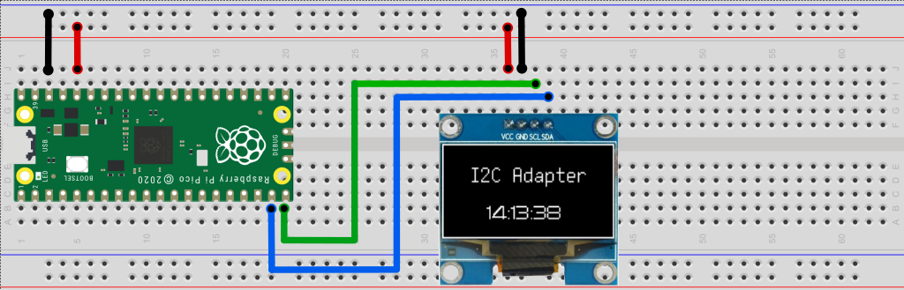

.. I2C Adapter API documentation master file, created by
   sphinx-quickstart on Sun Dec 31 17:40:24 2023.
   You can adapt this file completely to your liking, but it should at least
   contain the root `toctree` directive.

.. See rst cheat sheet at 
   https://docs.anaconda.com/restructuredtext/index.html

Overview
========

The I2C Adpater project allows to use off-the-shelf and inexpensive boards as USB to I2C bridge
by Mac, Windows, Linux and operating systems that supports portable Python. This document
describes the portable Python package ``i2c_adapter`` that provides the API to control the I2C Adapter.

|

|

Examples
========

Write and read I2C device 0x08 with the I2C Adapter at serial port COM7:

.. code-block:: python
  :linenos:

  from i2c_adapter import I2cAdapter

  i2c = I2cAdapter(port="COM7")
  i2c_addr = 0x08
  assert i2c.write(i2c_addr, bytearray([0]))
  data = i2c.read(i2c_addr,  20)
  print(data)

Scan the I2C bus for devices:

.. code-block:: python
  :linenos:

  from i2c_adapter import I2cAdapter

  i2c = I2cAdapter(port="COM18")
  print(f"Scanning I2C bus 0x00 to 0x7f:")
  for adr in range(0, 127):
      if i2c.write(adr, bytearray([0]), silent=True):
          print(f"  - Found an I2C  device at 0x{adr:02x}")

|

Supported Boards
================

The able below lists the currently supported boards.
To make your own I2C Adapter, get one of these boards, and flash it according to the manufacturer's 
instructions with the corresponding I2C Adpter firmware from https://github.com/zapta/i2c_adapter/tree/main/firmware/release. 

:Example: 
  For the Raspberry Pico and similar RP2040 boards, flash it by connecting the board
  to your computer while holding the BOOTSEL button pressed to have the your computer recognize 
  the board as a disk driver, then copying the firmware file to that driver.

+-------------------------------------------------------------------------------+-----------+------------+----------+---------+
|  Board                                                                        | SDA       |  SCL       | Internal | Max     |
|                                                                               |           |            | Pullups  | Voltage |
+===============================================================================+===========+============+==========+=========+
| `Raspberry Pico <https://www.raspberrypi.com/products/raspberry-pi-pico/>`_   | GP4       | GP5        |  No      |  3.3V   |
+-------------------------------------------------------------------------------+-----------+------------+----------+---------+
| `Sparkfun Pro Micro RP2040 <https://www.sparkfun.com/products/18288>`_        | Qwiic SDA | Qwiic SCL  | 2.2K     |  3.3V   |
+-------------------------------------------------------------------------------+-----------+------------+----------+---------+
| `Adafruit KB2040 <https://learn.adafruit.com/adafruit-kb2040/overview>`_      | Qwiic SDA | Qwiic SCL  | No       |  3.3V   |
+-------------------------------------------------------------------------------+-----------+------------+----------+---------+
| `Adafruit QT Py RP2040 <https://www.adafruit.com/product/4900>`_              | Qwiic SDA | Qwiic SCL  | No       |  3.3V   |
+-------------------------------------------------------------------------------+-----------+------------+----------+---------+

|

API Installation
================

The Python API package is available from PyPi at https://pypi.org/project/i2c-adapter and can be installed
on your computer using pip:

.. code-block:: shell

  pip install i2c_adapter

:Note: 
  The I2C Adapter boards appear on the computer as a standard CDC serial port and
  thus do not require driver installation.

|

API Reference
=============

.. automodule:: i2c_adapter
  :members:
  :member-order: bysource

|

The Wire Protocol
=================

The ``i2c_adapter`` package communicates with the I2C Adapter board by sending command requested on 
a serial connection and recieving command response. Each command and response is made of a plain sequence of
'binary' bytes with no special encoding such as end of line or escaping. Following is the 
specification request/response byte sequences of each of the protocol commands. For more details,
consult the `firmware protocol implementation <https://github.com/zapta/i2c_adapter/blob/main/firmware/platformio/src/main.cpp>`_.

Write Command
-------------

The write command writes 0 <= N <= 256 bytes to an I2C device with a given address.

**Request**

  .. table::
    :width: 90%
    :widths: 15,85

    +----------------------+---------------------------------------------+
    | Byte 0               | 'w' for Write.                              |
    +----------------------+---------------------------------------------+
    | Byte 1               | Device address in the range [0, 0x7f].      |
    +----------------------+---------------------------------------------+
    | Byte 2               | MSB of N, the data byte count.              |
    +----------------------+---------------------------------------------+
    | Byte 3               | LSB of N, the data byte count.              |
    +----------------------+---------------------------------------------+
    | ...                  | N Data bytes.                               |
    +----------------------+---------------------------------------------+

**Error Response**

  .. table::
    :width: 90%
    :widths: 15,85

    +----------------------+---------------------------------------------+
    | Byte 0               | 'E' for error.                              |
    +----------------------+---------------------------------------------+
    | Byte 1               | Error status byte. Provides additional      |
    |                      | informal information about the error.       |
    +----------------------+---------------------------------------------+

**OK Response**

  .. table::
    :width: 90%
    :widths: 15,85

    +----------------------+---------------------------------------------+
    | Byte 0               | 'K' for OK.                                 |
    +----------------------+---------------------------------------------+

|

Read Command
-------------

The read command reads 0 <= N <= 256 bytes from the I2C device with a given address.

**Request**

  .. table::
    :width: 90%
    :widths: 15,85

    +----------------------+---------------------------------------------+
    | Byte 0               | 'r' for Read.                               |
    +----------------------+---------------------------------------------+
    | Byte 1               | Device address in the range [0, 0x7f].      |
    +----------------------+---------------------------------------------+
    | Byte 2               | MSB of N, the number of bytes to read.      |
    +----------------------+---------------------------------------------+
    | Byte 3               | LSB of N, the number of bytes to read.      |
    +----------------------+---------------------------------------------+

**Error Response**

  .. table::
    :width: 90%
    :widths: 15,85

    +----------------------+---------------------------------------------+
    | Byte 0               | 'E' for error.                              |
    +----------------------+---------------------------------------------+
    | Byte 1               | Error status byte. Provides additional      |
    |                      | informal information about the error.       |
    +----------------------+---------------------------------------------+

**OK Response**

  .. table::
    :width: 90%
    :widths: 15,85

    +----------------------+---------------------------------------------+
    | Byte 0               | 'K' for OK.                                 |
    +----------------------+---------------------------------------------+
    | Byte 1               | MSB of N, the number of requested bytes.    |
    +----------------------+---------------------------------------------+
    | Byte 2               | LSB of N, the number of requested bytes.    |
    +----------------------+---------------------------------------------+
    | ...                  | The N bytes read.                           |
    +----------------------+---------------------------------------------+
 
|

Info Command
------------

The info command allows the client to retrieve information about the I2C Adapter.

**Request**

  .. table::
    :width: 90%
    :widths: 15,85

    +----------------------+---------------------------------------------+
    | Byte 0               | 'i' for Info.                               |
    +----------------------+---------------------------------------------+

**Response**

  .. table::
    :width: 90%
    :widths: 15,85

    +----------------------+---------------------------------------------+
    | Byte 0               | Number of bytes to follow (3)               |
    +----------------------+---------------------------------------------+
    | Byte 1               | Wire format version (1)                     |
    +----------------------+---------------------------------------------+
    | Byte 2               | Firmware version number MSB (0)             |
    +----------------------+---------------------------------------------+
    | Byte 3               | Firmware version number LSB (1)             |
    +----------------------+---------------------------------------------+

|

Echo Command
------------

The echo command accepts one data byte and sends it back. Allows the client to test the serial connection
to the I2C Adapter and the I2C Adapter readiness to accept new commands.

**Request**

  .. table::
    :width: 90%
    :widths: 15,85

    +----------------------+---------------------------------------------+
    | Byte 0               | 'e' for Echo.                               |
    +----------------------+---------------------------------------------+
    | Byte 1               | A data byte to echo.                        |
    +----------------------+---------------------------------------------+

**Response**

  .. table::
    :width: 90%
    :widths: 15,85

    +----------------------+---------------------------------------------+
    | Byte 0               | The data byte from the request.             |
    +----------------------+---------------------------------------------+

|

Firmware Development
=====================

The firmware is written in C++ and is developed as a platformio project under Visual Studio Code. The following
sections summarize the key aspect of the firmware development.

Project Structure
----------------------------
The platformio project resides in the firmware/platformio directory of the I2C Adapter repository https://github.com/zapta/i2c_adapter, 
the project configuration is in the `platformio.ini <https://github.com/zapta/i2c_adapter/tree/main/firmware/platformio>`_ file
and the source code is in the  `src directory <https://github.com/zapta/i2c_adapter/blob/main/firmware/platformio/src>`_.

Setting up the environment
--------------------------
1. Install Microsoft's Visual Studio Code ('VSC')
#. In VSC, add the extension 'platformio'
#. Clone the I2C Adapter `github repository <https://github.com/zapta/i2c_adapter>`_ on your computer.
#. Use VSC's 'file | open-folder', to open the 'platformio' directory in your local repository.
#. After platformio will complete installing the necessary tools, click on the 'build' icon in the status bar to verify that the project builds correctly.

Testing a new firmware version
------------------------------
1. Make the changes in the source code.
#. Connect a compatible board to your computer.
#. Select in the status bar the board target that matches your board.
#. Use the 'upload' button in the status bar to build and upload the binary to the board.

Generating new binaries
-----------------------
Run the python script 'build_env.py' and it will build binaries for all the targets and will copy them to 
release directory.

Adding a new board
------------------------------
Board definitions resides in platformio.ini and in src/board.cpp and the amount
of refactoring needed to add a board depends how close it is to the existing boards.
Adding a typical board includes adding:

* A new target to platformio.ini

* A new section in src/boards.cpp.

* A new row to the documentation's list.

* A new binary to the release.

|

Contact
=======

Bug reports and contributions are welcome. You can contact the team and fellow users at the 
gibhub repository at https://github.com/zapta/i2c_adapter.

.. toctree::
  :maxdepth: 2
  :caption: Contents:

