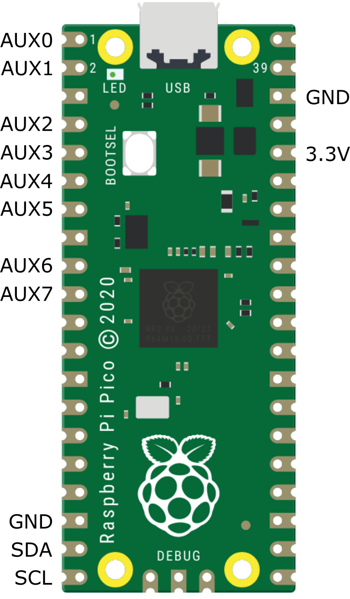

.. I2C Adapter API documentation master file, created by
   sphinx-quickstart on Sun Dec 31 17:40:24 2023.
   You can adapt this file completely to your liking, but it should at least
   contain the root `toctree` directive.

.. See rst cheat sheet at 
   https://docs.anaconda.com/restructuredtext/index.html

Overview
========

The I2C Adapter is a USB to SPI bridge that uses off-the-shelf and inexpensive boards such as the 
Raspberry Pi Pico, and control it using the python package ``i2c_adapter``.

For example, the diagram below shows the wiring to control an I2C OLED display using
USB and Python API. The full code is provided in the ``examples`` directory of the github repository.

|

.. image:: ../www/wiring_diagram.png
   :align: center

|

Examples
========

Writing and reading a I2C device 0x08 with the I2C Adapter at serial port COM7:

.. code-block:: python
  :linenos:

  from i2c_adapter import I2cAdapter

  i2c = I2cAdapter(port="COM7")
  i2c_addr = 0x08
  assert i2c.write(i2c_addr, bytearray([0]))
  data = i2c.read(i2c_addr,  20)
  print(data)

Scanning the I2C bus for devices:

.. code-block:: python
  :linenos:

  from i2c_adapter import I2cAdapter

  i2c = I2cAdapter(port="COM18")
  print(f"Scanning I2C bus 0x00 to 0x7f:")
  for adr in range(0, 127):
      if i2c.write(adr, bytearray([0]), silent=True):
          print(f"  - Found an I2C  device at 0x{adr:02x}")

|

Reading and writing auxiliary I/O pins:

.. code-block:: python
  :linenos:

  import time
  from spi_adapter import SpiAdapter, AuxPinMode

  # Customize for your system.
  port = "COM18"
  aux_out_pin = 0
  aux_in_pin = 1

  # Configure the two aux pins.
  spi = SpiAdapter(port)
  spi.set_aux_pin_mode(aux_out_pin, AuxPinMode.OUTPUT)
  spi.set_aux_pin_mode(aux_in_pin, AuxPinMode.INPUT_PULLUP)

  # Access the two pins.
  i = 0
  while True:
    i += 1
    spi.write_aux_pin(aux_out_pin, i % 2)   # Generates a square wave
    in_value = spi.read_aux_pin(aux_in_pin)
    print(f"{i:03d}: Input pin value: {in_value}", flush=True)
    time.sleep(0.5)

|

Supported Boards
================

The able below lists the currently supported boards.
To make your own I2C Adapter, get one of these boards, and flash it according to the manufacturer's 
instructions with the corresponding I2C Adpter firmware from https://github.com/zapta/i2c_adapter/tree/main/firmware/release. 

:Example: 
  For the Raspberry Pico and similar RP2040 boards, flash it by connecting the board
  to your computer while holding the BOOTSEL button. Once your computer recognized the board 
  as a new hard driver, release the button and copy the firmware file to that hard drive.

+-------------------------------------------------------------------------------+-----------+----------+------------+
|  Board                                                                        | SDA, SCL  | Pullup   |  Aux Pins  |
|                                                                               |           | ups      |            |
+===============================================================================+===========+==========+============+
| `Raspberry Pico <https://www.raspberrypi.com/products/raspberry-pi-pico/>`_   | GP 14, 15 | Weak     | GP 0-7     |
+-------------------------------------------------------------------------------+-----------+----------+------------+
| `Sparkfun Pro Micro RP2040 <https://www.sparkfun.com/products/18288>`_        | Qwiic SDA | 2.2K     | GP 0-7     |
+-------------------------------------------------------------------------------+-----------+----------+------------+
| `Adafruit KB2040 <https://learn.adafruit.com/adafruit-kb2040/overview>`_      | Qwiic SDA | Weak     | GP 0-7     |
+-------------------------------------------------------------------------------+-----------+----------+------------+
| `Adafruit QT Py RP2040 <https://www.adafruit.com/product/4900>`_              | Qwiic SDA | Weak     | GP 0-7     |
+-------------------------------------------------------------------------------+-----------+----------+------------+

|

:Note: 
  The RP2040 contains weak I2C pullup resistor that are sufficient for many cases. If needed, add
  external 3K to 10K pullup resistors on the SDA and SCL lines.

|

Raspberry PI Pico Pinout
========================
The diagram below shows the pinout for the popular Raspberry Pi Pico. For the other supported board, consult the table above.

   
|

API Installation
================

The Python API package is available from PyPi at https://pypi.org/project/i2c-adapter and can be installed
on your computer using pip:

.. code-block:: shell

  pip install i2c_adapter

:Note: 
  The I2C Adapter boards appear on the computer as a standard CDC serial port and
  thus do not require driver installation.

|

API Reference
=============

.. automodule:: i2c_adapter
  :members:
  :member-order: bysource

|

The Wire Protocol
=================

The ``i2c_adapter`` package communicates with the SPI Adapter board by sending commands
and receiving command responses on a serial connection. The commands and responses are made of a plain sequence of
'binary' bytes with no special encoding such as end of line or byte stuffing. For 
an updated specification of the commands and their wire representation see the  
`firmware protocol implementation <https://github.com/zapta/spi_adapter/blob/main/firmware/platformio/src/main.cpp>`_.

|

Firmware Development
=====================

The firmware is written in C++ and is developed as a platformio project under Visual Studio Code. The following
sections summarize the key aspect of the firmware development.

Project Structure
----------------------------
The platformio project resides in the firmware/platformio directory of the I2C Adapter repository https://github.com/zapta/i2c_adapter, 
the project configuration is in the `platformio.ini <https://github.com/zapta/i2c_adapter/tree/main/firmware/platformio>`_ file
and the source code is in the  `src directory <https://github.com/zapta/i2c_adapter/blob/main/firmware/platformio/src>`_.

Setting up the environment
--------------------------
1. Install Microsoft's Visual Studio Code ('VSC')
#. In VSC, add the extension 'platformio'
#. Clone the I2C Adapter `github repository <https://github.com/zapta/i2c_adapter>`_ on your computer.
#. Use VSC's 'file | open-folder', to open the 'platformio' directory in your local repository.
#. After platformio will complete installing the necessary tools, click on the 'build' icon in the status bar to verify that the project builds correctly.

Testing a new firmware version
------------------------------
1. Make the changes in the source code.
#. Connect a compatible board to your computer.
#. Select in the status bar the board target that matches your board.
#. Use the 'upload' button in the status bar to build and upload the binary to the board.

Generating new binaries
-----------------------
Run the python script 'build_env.py' and it will build binaries for all the targets and will copy them to 
release directory.

Adding a new board
------------------------------
Board definitions resides in platformio.ini and in src/board.cpp and the amount
of refactoring needed to add a board depends how close it is to the existing boards.
Adding a typical board includes adding:

* A new target to platformio.ini

* A new section in src/boards.cpp.

* A new row to the documentation's list.

* A new binary to the release.

|

Contact
=======

Bug reports and contributions are welcome. You can contact the team and fellow users at the 
gibhub repository at https://github.com/zapta/i2c_adapter.

.. toctree::
  :maxdepth: 2
  :caption: Contents:

